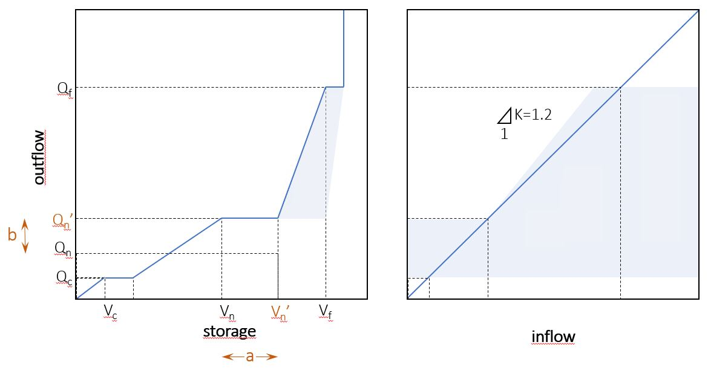
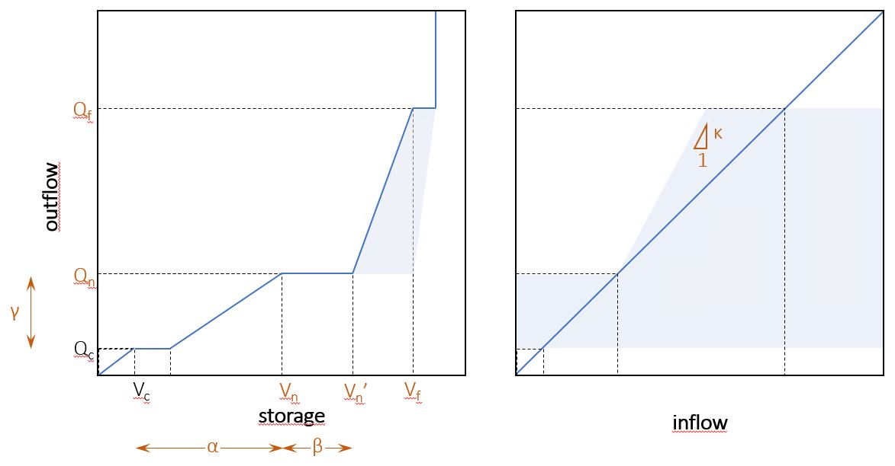
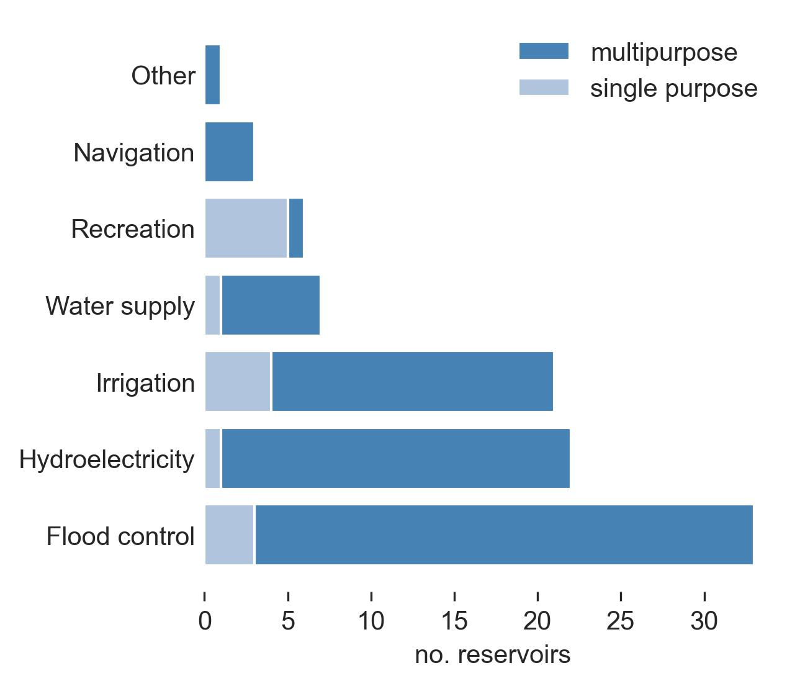
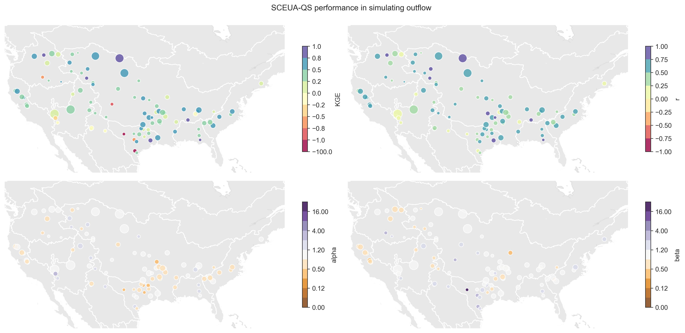
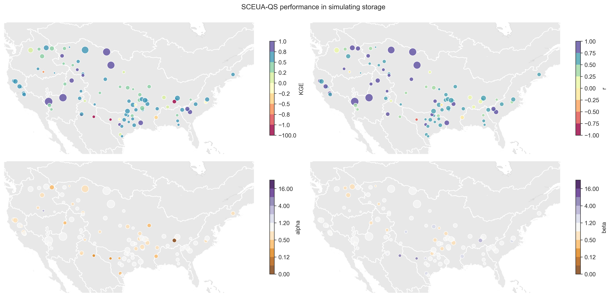
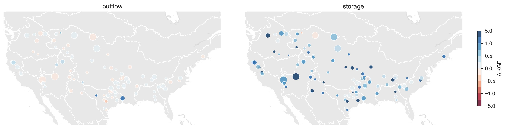
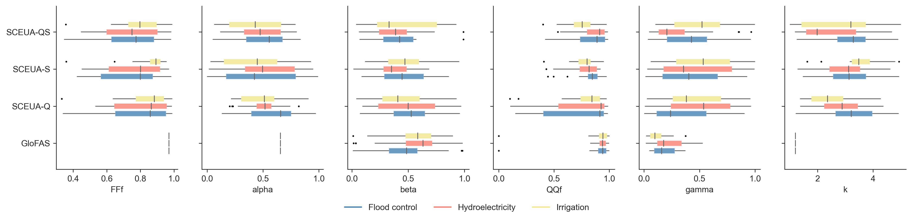
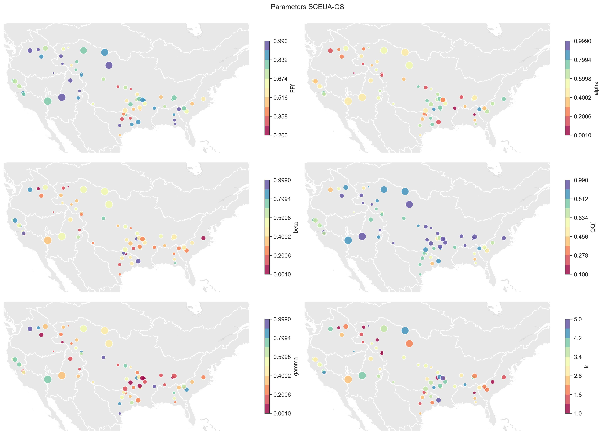

# Calibration of GloFAS reservoirs in the US
***

## 1 Introduction

In a [first step of the analysis](https://github.com/casadoj/LF_water_bodies/blob/main/docs/performance_US.md) of how LISFLOOD models reservoirs, I compared the observed data from the data set ResOpsUS [(Steyaert et al., 2022)](https://www.nature.com/articles/s41597-022-01134-7) with the results of the GloFASv4 long run in 121 reservoirs in the US. One of the main outcomes of this analysis was that, even though the simulation of reservoir outflow is fairly good, the simulation of reservoir storage is poor. The main reason for this poor storage representation is that the LISFLOOD reservoir parameters are fitted using only discharge observations (not outflow), so the calibration does not try to reproduce any known storage behaviour. Another reason for the poor performance is that only 2 of the reservoir parameters are fitted (normal outflow and normal storage), whereas the analysis showed that the fixed storage zones do not match observations in many reservoirs. On top of it all, the reservoir routine in LISFLOOD may be too simplistic, since it is the same for any season of the year and any reservoir use.

Before testing more complicated reservoir routines, I decided to try to find the maximum potential of the current LISFLOOD reservoir routine. To do so I have conducted three independent calibrations on 93 reservoirs in the ResOpsUS data set. These calibrations fit 6 parameters that define the normal and flood behaviour of the reservoir; only the minimum storage and outflow are fixed. The difference between the three calibrations is the target variable. The first two calibrations are univariate, one targets the outflow time series and the other the storage time series. The third and last calibration is bivariate, targeting both outflow and storage. In all three calibrations the optimization algorithm is the Shuffle Complex Evolution-University of Arizona (SCEUA) [(Duan et al., 1992)](https://agupubs.onlinelibrary.wiley.com/doi/abs/10.1029/91WR02985), and the objetive function is the modified Kling-Gupta Efficiency Coefficient (KGE) [(Knoben et al., 2019)](https://hess.copernicus.org/articles/23/4323/2019/).

This report presents the data, methods and results of these three calibrations and compares the outcomes with GloFASv4.

## 2 Data

The observed data is taken from ResOpsUS, which contains time series of several variables including inflow, storage and outflow. As mentioned in the previous report, only 121 of the 679 reservoirs in the ResOpsUS data set are modelled in GloFAS. However, of those 121 reservoirs only 93 contain time series of both outflow and storage, which are the two target variables in the calibration. Therefore, in this report the sample of reservoirs is limited to 93.

The GRanD database [(Lehner et al., 2011)](https://www.globaldamwatch.org/grand/) includes the different uses of the reservoirs and classifies them in main, secondary, etc. This information was used in the analysis of the results of the calibration to infer different behaviours depending on the use of the reservoir.

The GloFASv4 long run is used both as a benchmark and as an input to the reservoir simulation. To be able to compare the performance of GloFAS in simulating reservoirs and the performance of the calibrations in this analysis, the inflow into the reservoirs must be the same. This approach also allows us to include more reservoirs in the analysis, because the ResOpsUS does not include the inflow time series in some of the 93 reservoirs. Even more, in the future I could run the calibration on reservoirs in ResOpsUS that are not modelled in GloFAS; I would need to extract the inflow time series from the GloFASv4 long run and the attributes from GRanD.

## 3 Methods

### 3.1 GloFAS calibration

Figure 1 shows the LISFLOOD reservoir routine and the two parameters that are fitted during calibration. The calibration of reservoirs in LISFLOOD only allows to tune the normal outflow ($Q_n'$) and the upper bound of the storage that produces this normal outflow ($V_n'$). All the other 6 parameters are fixed. The three storage limits ($V_c$, $V_n$, $V_f$) are constant for all reservoirs. The outflow parameters ($Q_c$, $Q_n$, $Q_f$) are reservoir specific (I guess they are fixed quantiles of some time series). I add an extra parameter ($\kappa$) that controls the maximum allowed outflow with respect to the inflow in the flood control zone; in the LISFLOOD code this parameters has a fixed value of $1.2$.

The GloFAS calibration does not tune directly the parameters $V_n'$ and $Q_n'$, but it uses two indirect hyperparameters (here called $a$ and $b$). The equations below show the relation between these hyperparameters and the reservoir parameters:

$$
\begin{align*}
V_n' &= V_n + a \cdot (V_f - V_n) & \forall \; a &\in (0, 1) \\
Q_n' &= b \cdot Q_n & \forall \; b &\in (0.25, 2) \\
\end{align*}
$$

***Figure 1**. LISFLOOD reservoir routine including its parameters. Parameters in orange are those fitted in GloFASv4 using discharge data in a gauging station downstream. The blue line represents the reference routine, and the blue shade the allowed variation depending on several conditions (mostly inflow).*

It is important to keep in mind that the calibration of the rerservoir parameters in GloFAS is done based on discharge at a downstream gauging station. This means that the reservoir simulation is only one of the multiple factors affecting the performance of the model. In this setup, calibrating more reservoir parameters will only add more complexity to the calibration with no effect on the performance, since the reservoir problem is not constrained enough if we only compare discharge downstream.

### 3.2 Reservoir-specific calibration

#### 3.2.1 Parameters

In this study I have actual reservoir time series which can be used to train the reservoir routine. This allows me to add more flexibility to the calibration, i.e., more parameters to be tuned. Figure 2 shows the same LISFLOOD routine as Figure 1, but with the parameters that will be calibrated specifically for each reservoir.

***Figure 2**. LISFLOOD reservoir routine including its parameters. Parameters in orange are those fitted in the calibrations performed in this study. The blue line represents the reference routine, and the blue shade the allowed variation depending on several conditions (mostly inflow).*

Instead of 2 parameters, in this study I will calibrate 6 parameters: 3 regarding storage ($V_n$, $V_n'$, $V_f$), and 3 regarding outflow ($Q_n$, $Q_f$, $\kappa$). In summary, all but the minimum storage and outflow. In reality, I will not calibrate the parameters directly, but a set of 5 hyperparameters; the equations below show the relation between parameters and hyperparameters. Only the $\kappa$ parameter will be calibrated directly.

$$
\begin{align*}
V_f &= FF_f \cdot V_{tot} & \forall \, FF_f &\in [0.2, 1) \\
V_n &= V_c + \alpha \cdot (V_f - V_c) & \forall \, \alpha &\in (0, 1) \\
V_n' &= V_n + \beta \cdot (V_f - V_n) & \forall \, \beta &\in (0, 1) \\
Q_f &= I_{QQ_f} & \forall \, QQ_f &\in [0.1, 1) \\
Q_n &= Q_c + \gamma \cdot (Q_f - Q_c) & \forall \, \gamma &\in (0, 1)
\end{align*}
$$

In words:
* The upper bound of the flood zone ($V_f$) is a proportion ($FF_f$) of the total reservoir capacity.
* The lower bound of the normal zone ($V_n$) is a fraction ($\alpha$) of the difference between the flood storage ($V_f$) and the minimum storage ($V_c$).
* The upper bound of the normal zone ($V_n'$) is a fraction ($\beta$) of the difference between the flood storage ($V_f$) and the normal storage ($V_n$).
* The flood outflow ($Q_f$) is a quantile ($QQ_f$) of the inflow simulated in the GloFAS long run. This will allow us to estimate this parameter for any reservoir, regardless of the availability of reservoir records.
* The normal outflow ($Q_n$) is a fraction ($\gamma$) of the difference of the flood ($Q_f$) and minimum ($Q_c$) outflows.
* The parameter $\kappa$ ranges between 1 (no regulation) and 5 (barely no limitation in the outflow).

#### 3.2.2 Targets

I will carry out three different calibrations. All the calibrations will be done using the genetic optimization algorithm SCEUA, with a configuration of 8 complexes and a maximum of 1000 iterations. All the simulations use the GloFASv4 simulated inflow as the input to the model and the observed storage at the beginning of the simulations as the initial condition. Using GloFAS simulated discharge allows us to include reservoirs for which ResOpsUS does not contain the inflow time series; it also avoids issues with gaps in the inflow time series; on top of that, it would allow us to expand the analysis to any other reservoir, not only those in ResOpsUS or GloFAS.

The difference between calibrations is the target variable:

1. **SCEUA-Q** is a calibration that optimizes the simulation of reservoir outflow. The objective is to check whether it is possible to improve the simulation of outflow by allowing a larger degree of freedom in the calibration.
2. **SCEUA-S** is a calibration that optimizes the simulation of reservoir storage. Since GloFAS does not reproduce correctly storage, this calibration aims at finding the correct values of the storage zones. 
3. **SCEUA-QS** is a bivariate calibration that optimizes both outflow and storage. The initial results of **SCEUA-Q** showed a large equifinality in the optimal parameters; by adding the storage as a new constraint, I try to shrink the optimal parameter space, and avoid parameterizations that perform correctly in terms of outflow, but not in terms of storage (as seen in the GloFAS simulations).

In all cases the objective function is the modified KGE, a metric that combines three components: the coefficient of correlation ($r$), the bias or quotient of the means ($\mu$), and the quotient of the coefficient of variation ($CV$). The bivariate calibration requires a metric that combines KGEs of outflow and storage. Following the concept of the KGE (Euclidean distance of three components to their optimal value of 1), I combine the 2 KGEs of outflow and storage as the Euclidean distance from the optimal point (1, 1).

$$
\begin{align*}
KGE' &= \sqrt{(1 - r)^2 + \left(1 - \frac{\mu_{\text{sim}}}{\mu_{\text{obs}}}\right)^2 + \left(1 - \frac{CV_{\text{sim}}}{CV_{\text{obs}}}\right)^2} \\
KGE_{\text{bivariate}}' &= \sqrt{(1 - KGE_Q')^2 + (1 - KGE_S')^2}
\end{align*}
$$

## 4 Results

### 4.1 Main use of the reservoirs

Before diving into the results of the calibration, Figure 3 shows the main use of the 93 reservoirs of this study as reported by GRanD. The counts are divided by single and multi-purpose reservoirs.

***Figure 3**. Main use of the 93 reservoirs included in the calibration, indicating whether the reservoir has a single or multiple purpose.*

The majority of the reservoirs of the sample are used primarily for flood control; however, few are single-purpose. The other two main uses are hydropower production and irrigation.

### 4.2 Performance

Figure 4 shows the overall performance of the 4 parameter sets: GloFAS (as benchmark) and the 3 calibrations here performed. The figure shows the KGE regarding outflow, storage, and the combinations of those, regardless of the target variable in the calibration.

***Figure 4**. Overall performance of the 93 reservoirs in terms of outflow (left panel), storage (central panel), and combined outflow and storage (right panel). _SCEUA-Q_ corresponds to the univariate calibration of outflow, _SCEUA-S_ to the univariate calibration of storage, and _SCEUA-QS_ to the bivariate calibration.*

The univariate calibration of outflow (**SCEUA-Q**) outperforms GloFAS in the simulation of outflow, but by a meagre margin. Despite the increased flexibility of the calibration setup and the availability of reservoir records, the performance has barely improved. This can mean that the GloFAS calibration did a good job in representing outflows, or that the reservoir routine is very limited. In terms of storage, this calibration performs similarly as GloFAS.

The univariate calibration of storage (**SCEUA-S**) clearly outperforms GloFAS in the simulation os reservoir storage. That is no surprise, since the GloFAS calibration never saw a value of observed storage. Particularly interesting, though, is the performance of this calibration in terms of outflow, which is only slightly poorer than GloFAS, even though no outflow time series were presented during calibration. When looking at the combined performance, of course this approach outperforms GloFAS, since the simulation of storage is way better and the loss in outflow simulation is minor. The implications of these results are that a calibration based on storage, instead of outflow, is more succesful, which may be useful in a global model, since records of reservoir outflow are scarce, but there are several data sets of reservoir storage based on satellite products.

As it could be expected, the bivariate calibration (**SCEUA-QS**) falls in a middle ground between the two univariate calibrations. The losses in performance compared with the univariate calibrations are minimal, both in terms of outflow and storage, but it outperforms GloFAS in all cases: outflow, storage and the combination of both.

Figure 5 and Figure 6 show the geographical distribution of the performance of the bivariate calibration (**SCEUA-QS**), that with the highest performance. Both show the KGE and its three components. Figure 5 shows performance in terms of revervoir outflow, and Figure 6 performance in terms of reservoir storage. The objective of these plots is to identify possible geographic/climatic patterns in the performance.

***Figure 5**. Performance of the bivariate calibration in terms of **outflow**. The top, left map shows the objective function of the calibration, KGE, whereas the other three maps show the components of the KGE: r for coefficient of correlation, alpha for the quotient of the coefficients of variation, and beta for the bias (the quotient of the means). The size of the dots represents the reservoir capacity.*

As commented above, the KGE of outflow is overall good. There are a few reservoirs with very poor performance, most of them in the Central Southern US. Reservoir in the Western US show slightly lower performance that those in the Central and Eastern US. When looking at the components of the KGE, the main errors are in the variability (alpha) and bias (beta). All the reservoirs with a poor KGE show a high positive bias, which could be an indicator of issues in the observed time series. The lack of variation is the main problem in the Eastern part, even though KGE is high.

***Figure 6**. Performance of the bivariate calibration in terms of **storage**. The top, left map shows the objective function of the calibration, KGE, whereas the other three maps show the components of the KGE: r for coefficient of correlation, alpha for the quotient of the coefficients of variation, and beta for the bias (the quotient of the means). The size of the dots represents the reservoir capacity.*

The performance in terms of storage is high in most of the US. Unlike outflow, the reservoirs with highest performance cluster in the North-Western US. Apart from one case, the reservoirs with poor performance in outflow and storage don't match. From the three components of the KGE, the most problematic seems to be the variation (alpha). Again, the worst performing reservoirs are those with a large positive bias.

Figure 7 shows the difference in performance (KGE) between the SCEUA-QS calibration and GloFAS. Posivite $\Delta KGE$ values represent gains and negative values losses in performance. 

***Figure 7**. Comparison of the performance (in terms of KGE) between the GloFASv4 simulations and the results of the bivariate calibration. The left panel shows the change in KGE regarding outflow, and the right panel that regarding storage. Positive values mean an improvement in the new calibration, negative values a loss of performance.*

There is a clear pattern in the two maps above. Whereas only two reservoirs show a strong change in outflow performance (in both cases positive), the majority of reservoirs improved notably the storage simulation.

### 4.3 Optimized parameters

Figure 8 is meant to find patterns in the optimized parameters depending on the main use of the reservoir. Only the main three reservoir uses are shown: flood control, hydropower and irrigation. Each plot compares the values obtained from the 3 calibrations and what would be the value of that parameter in GloFAS. As GloFAS only calibrated two parameters ($\beta$ and $\gamma$), only those parameters show dispersion. The dispersion in GloFAS $QQ_f$ is caused by the fact that I do not know how the flood outflow ($Q_f$) was derived; I have computed $QQ_f$ as the quantile of the GloFAS inflow series associated to $Q_f$. Reservoirs with a combined KGE (outflow and storage) lower than 0 were removed from the sample used to create these plots.

***Figure 8**. Parameters of the LISFLOOD reservoir routine in GloFAS and the three calibrations. The boxplots show the variation among the reservoirs whose main use is flood control, hydropower and irrigation. To avoid spurious parameterizations, reservoirs with a combined KGE (outflow & storage) lower than 0 were removed.*

Some of the GloFAS parameters differ clearly from the three calibrations in this study. The flood storage ($FF_f$) and the normal storage ($\alpha$) are too high, whereas the normal outflow ($\gamma$) and the release coefficient ($\kappa$) are too low. This last parameter is the one that shows the biggest difference between GloFAS and the calibrations. Whereas in GloFAS this parameter does not allow for outflows larger than 120% times the inflow, the large values obtained in the calibration allow for outflows several times larger than the inflow.

The parameters obtained in the three calibrations differ substantially. SCEUA-QS shows in general the lowest dispertion among reservoirs, as it could be expected because is the calibration with more constraints; only the release coefficient ($\kappa$) is an exception. Even though it does not apply to every parameter, it seems that the univariate calibration of storage obtains parameterizations closer to SCEUA-QS; remember that these two parameterizations obtained close performances.

Differences among the three main reservoir uses are very subtle. When looking at the best calibration (SCEUA-QS), the major differences are in the hydropower resevoirs, whose normal outflow ($\gamma$) and release coefficient ($\kappa$) are notably lower than in the other two uses. Surprisingly, the flood control reservoirs do not show differences in neither the flood storage zone ($FF_f$, $\beta$) nor in the flood ouflow ($QQ_f$).

The maps in Figure 9 try to find geographical patterns in the parameters optimized in the SCEUA-QS calibration. As in Figure 8, reservoirs with poor performance (combined KGE lower than 0) were removed. The colour scales represent the search range set up in the calibration.

***Figure 9**. Maps of the parameters optimized in the calibration SCEUA-QS. To avoid spurious parameterizations, reservoirs with a combined KGE (outflow & storage) lower than 0 were removed.*

There is only a clear pattern that affects the reservoirs in the South-East. A fair number of the reservoirs in this area show a surprisingly low flood storage ($FF_f$), which means that either a large volume of the reservoir is the freeboard in case of flood, or the reservoir capacity is erroneously large. Most of the reservoirs in this same area of the country also show relative high values of normal storage ($\alpha$), which means that the normal storage zone covers a large proportion of the usable reservoir storage.

## 5 Conclusions

This document reports the results of the optimization of the LISFLOOD reservoir routine for 93 reservoirs in the US. Three calibrations are presented that differ in the target variable(s): outflow, storage or both. The best performances are obtained for the calibration of reservoir storage and the bivariate calibration. The fact that the calibration of storage renders better results than that of outflow is interesting, since global datasets of reservoir storage have been derived from satellite products. The comparison of the optimized parameters and those used in GloFAS (most of them fixed) show deficits in the GloFAS parameterization. Unfortunately, the obtained parameters do not show clear patterns neither regarding reservoir use nor geographic location.

There are several points that could be improved/added to this analysis:

* Add more reservoirs. As the calibration only requires GloFAS inflow time series and the storage capacity of the reservoir, it could be expanded to all the reservoirs in the ResOpsUS data set even if they are not included in the current GloFAS setup. A larger sample of reservoirs would improve the conclusions of the analysis and help in a future regionalization of the reservoir parameters.
* Regionalization is needed to infer the parameters in reservoirs with no records. The regionalization could be based on reservoir use, location, climate, size... Unfortunately, the results here presented do not show clear patterns. In any case, a test could be done on the GloFAS reservoirs not included in ResOpsUS.
* KGE was selected as the objective function in all the three calibrations. This metric may not be the most appropriate to optimize the reservoir behaviour during floods. Moreover, the combination of the outflow and storage KGE in the bivariate calibration gives equal value to the simulation of storage and outflow, which enhances the storage performance compared with GloFAS at the expense of a poorer representation of outflow peaks.
* The calibration procedure left out a 30% of the available records to validate the optimized parameters, but the validation was not included in this report.
* The selection of 6 reservoir parameters was purely subjective. A sensitivity analysis could reduce this number of parameters so that the calibration focuses only on those that are sensitive.
