# Comparison of the GloFAS reservoir simulation with reservoir records in the US
***

## 1 Introduction

As a first approach to the improvement of the LISFLOOD reservoir routine, I have compared the results of the LISFLOOD reservoir simulations with available observations. The idea is to identify limitations of the current routine or parameterization and come up with ideas for improving the representation of reservoirs in LISFLOOD.

## 2 Data

The main limitation for this analysis is the availability of reservoir observations. I will use the data set **ResOpsUS** [(Steyaert et al., 2022)](https://www.nature.com/articles/s41597-022-01134-7), a compilation of reservoir operation in the conterminous US. ResOpsUS contains daily time series of reservoir operations (storage, inflow, outflow, evapotranspiration and level) for 679 major reservoirs in the US.

The ResOpsUS time series will be compared with the daily time series simulated in the **GloFASv4** long run from 1982 to 2019. GloFASv4 represents 150 reservoirs in the US, but not all of them are included in ResOpsUS. 121 reservoirs are both represented in the ResOpsUS data set and GloFASv4, but in 8 of them the observed and simulated time series do not overlap. On top of that, there are 6 reservoirs I could not find their corresponding catchment in the GloFAS calibration, so I do not have the simulated time series. To sum up, the analysis below  comprises **113 reservoirs**.

### 2.1 Uncertainty on the total reservoir capacity

I've noticed that the reservoir storage capacity in GloFAS (taken from GLWD), GRanD and ResOpsUS are note coherent. [Steyaert and Condon (2023)](https://hess.copernicus.org/preprints/hess-2023-194/) also found that the maximum capacity of 100 reservoirs in GRanD were not coherent with the observed records from ResOpsUS. As the reservoir routine in LISFLOOD is based on the fraction filled (the quotient of the storage and the total capacity), this uncertainty in the total reservoir capacity may affect the comparison of the simulated and observed storage.

To limit this uncertainty, I have compared the values of total capacity from three data sets (GloFAS, GRanD and ResOpsUS) and manually select for each reservoir whether GRanD or GloFAS is the data source more coherent when comparing against the observations from ResOpsUS. The plot below compares the maximum observed storage (ResOpsUS) against the total reservoir capacity reported both in GloFAS and GRanD. The Spearman correlation coefficient ($R^2$) gives an idea of the coherence between each pair of data sets.

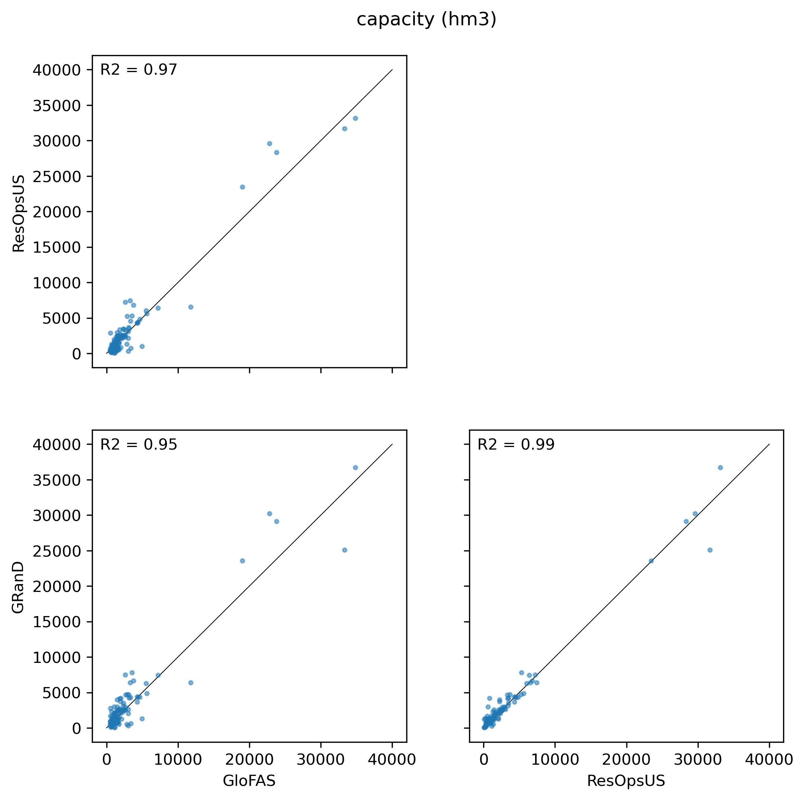

***Figure 1**. Scatter plots of total reservoir capacity in three different data sets: ResOpsUS, GRanD and GloFAS.*

In general, the agreement between the 3 capacity data sets is good (correlation larger than 0.95). GRanD seems to agree better with ResOpsUS than GloFAS, but still some points deviate notably from the 1:1 relationship.

## 3 LISFLOOD model parameters

Before analysing the performance of the simulations, I had a look at the calibrated parameters, both at its statistical and geographical distribution. Two reservoir parameters were fitted during calibration: _adjustNormalFlood_ modulates the normal reservoir storage limit, _ReservoirRnormqMult_ is a multiplier of the default value of the normal outflow. The maps below show the geographical distribution of the fitted parameter values.

Add the sketch of the reservoir routine

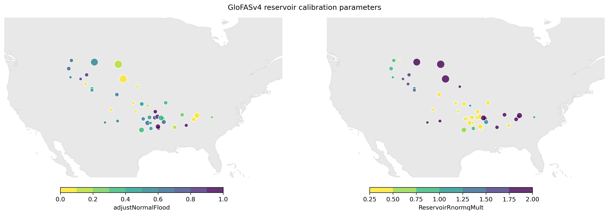

***Figure 2**. Values of the LISFLOOD reservoir parameters calibrated in GloFASv4. The size of the dots corresponds to the total reservoir capacity.*

Both parameters take values throughout the whole search range (0-1 for _adjustNormalFlood, 0.25-2 for ReservoirRnormqMult_). Whereas _adjustNormalFlood_ has a tendency towards central values, _ReservoirRnormqMult_ often takes extreme values. 
* `adjustNormalFlood` does not seem to have any clear geographical pattern. Some reservoirs in central US take low values of this parameter, but these low values are not restricted to these central area. In general, large reservoirs seem to take low values.
* `ReservoirRnormqMult` does show some geographical pattern. The reservoirs in the Southeast take all very low values. The size of the reservoir seems to have some influence too; except for one case, the largest reservoirs adopt values close to the upper limit.

The maps below show the 4 reservoir limits in the LISFLOOD routine (1 related to storage and 3 to outflow). $nlim_{adj}$ is the normal reservoir storage adjusted by the calibrated parameter _adjustNormalFlood_; $minq$ is the minimum outflow; $normq_{adj}$ is the normal outflow adjusted by the calibrated parameter _ReservoirRnormqMult_; $ndq$ is the non-damaging outflow.

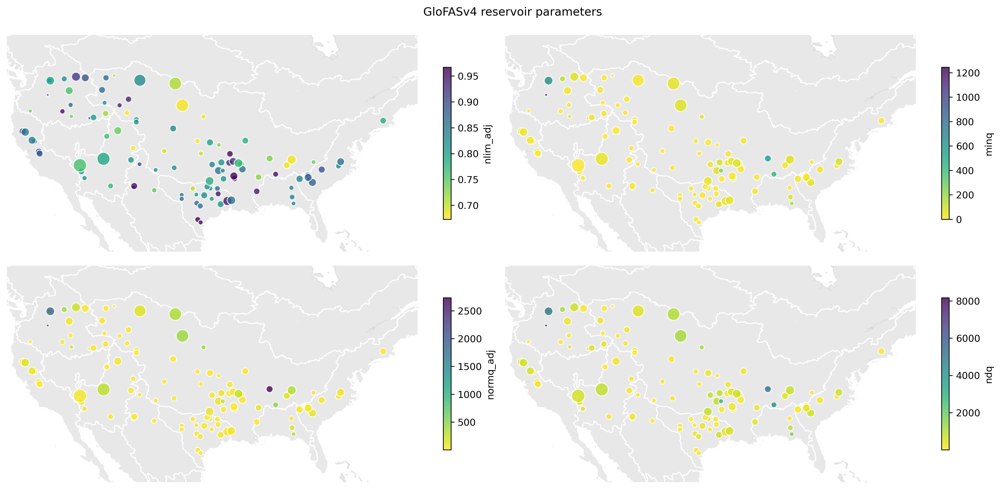

***Figure 3**. Values of the LISFLOOD reservoir limits in GloFASv4. The size of the dots corresponds to the total reservoir capacity.*

The top left panel, that represents the adjusted normal storage, is similar to the map of _adjustNormalFlood_ in Figure 2, only with a different scale. The other three plots, that represent outflow limits, show a similar pattern. There are a few reservoirs ($ResID=[150,386,581]$) that stand out for having outflow limits notably larger than the majority.

> Specific case. There is a reservoir ($ResID=193$) with unrealistically low outflow parameters (0.0, 0.0, 0.1 m3/s).

## 4 Performance

In the following subsections I will explore the performance of the GloFASv4 reservoir simulation compared with the observations in ResOpsUS. I will analyse separately three variables: storage, inflow and outflow.

### 4.1 Reservoir storage

The maps below show the performance of the reservoir storage simulations in GloFAS, both in terms of the modified KGE and its three components.

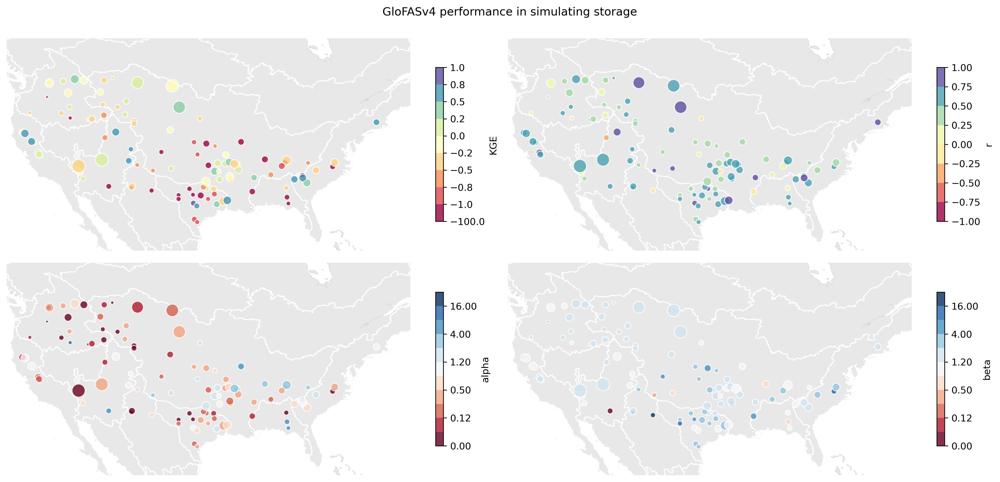

***Figure 4**. GloFASv4 performance in simulating reservoir storage. It shows the modified Klin-Gupta efficiency coefficient (KGE) and its three components: correlation (r), ratio of the coefficient of variance (alpha) and bias (beta). The size of the dots represents total reservoir capacity.*

The performance in the simulation of reservoir storage is rather poor. 36% of the reservoirs have a modified KGE below -0.41 (the performance of the mean value). The majority of reservoirs with poorer performance concentrates in the Southeast US. It's important to notice here that the reservoir storage has not been calibrated directly, only streamflow was calibrated, so a good performance was not expected to be found. 

When looking at the components of the KGE, we get a different picture. The correlation coefficient ($r$) is overall good, which means that the simuations mostly follow the trend and seasonality of the reservoir storage. On the other hand, both the bias ($beta$) and the ratio of the coefficient of variation ($alpha$) are poor. There's a general high positive bias ($beta$), which means that the **simulations tend to overestimate storage**. On the contrary, the low values of $alpha$  indicate that **the coefficient of variation of the simulated storage is too small**.

#### 4.1.1 Time series decomposition

Following the analysis of [Steyaert and Condon (2023)](https://hess.copernicus.org/preprints/hess-2023-194/) I have decomposed the daily time series in three components: trend, seasonality and residuals. The trend is a moving average with a width of 365 days. The seasonality is the monthly mean of the detrended time series. The residuals is the difference between the original series and the addition of trend and seasonality. I have applied the decomposition on both the observed and simulated time series and compared the performance in each of the components. The idea is to identify the component that mostly fails in the simulation.

The analysis was done for all the reservoirs, but here I show only three cases. The plots below show the comparison of the observed and simulated time series in its original form, and in the trend, seasonality and residual components. Each of the time series show the performance in terms of the KGE and its components. The dotted, vertical lines show the reservoir storage limits.

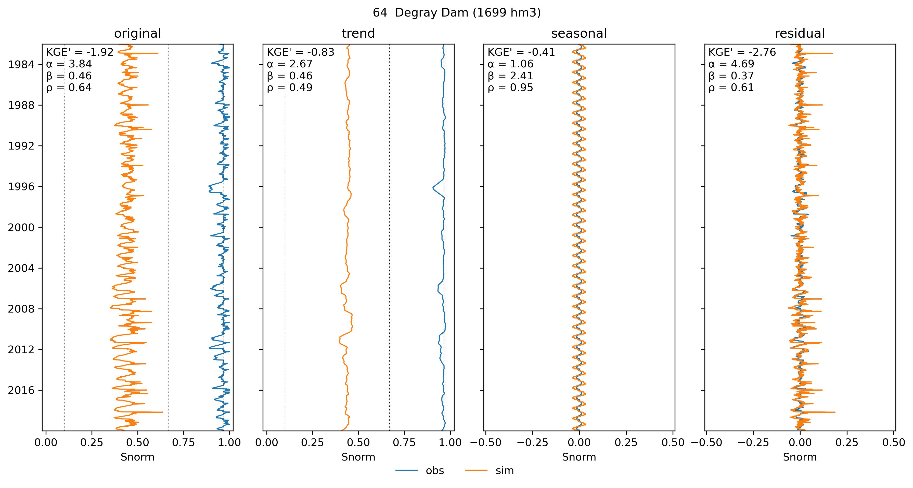
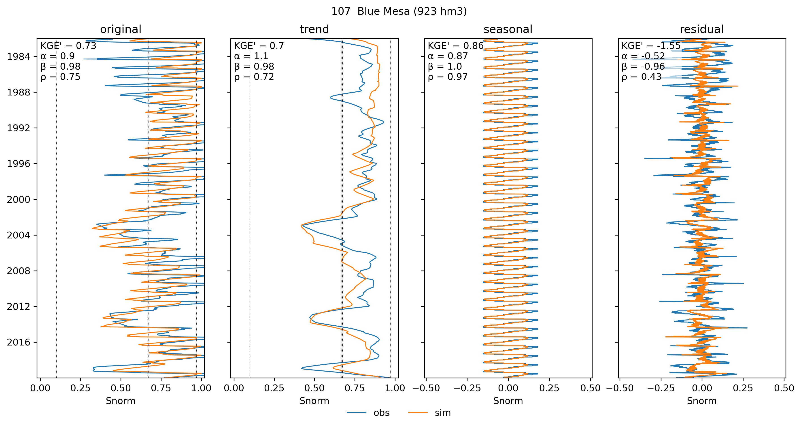
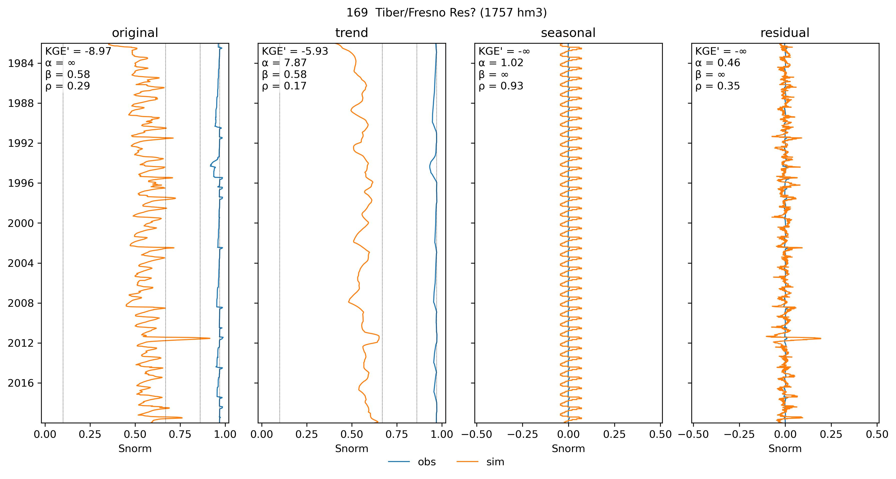

***Figure 5**. Time series of reservoir storage and their decomposition in trend, seasonality and residuals. The dotted, vertical lines show the reservoir storage limits used in the LISFLOOD reservoir routine.*

The reservoir 64 shows the common case in which the reservoir routine captures adequately the seasonality, but there is a large bias in the trend, which causes a poor KGE in the original time series. There is a set of reservoirs whose simulated storage is constantly around the flood limit. This incorrect behaviour can be caused by the reservoir storage limits. In the specific case of reservoir 64, the adjusted normal storage is very close to the flood storage (both well above the observed values), and the reservoir stays almost full for the complete simulation.

The reservoir 107 shows a case in which the reservoir routine performs very well. Goth the trend and the seasonality are correctly captured by the GloFAS simulation. In this specific case the adjusted normal storage is very close to the normal storage, but that is not the case in other good-performing reservoirs.

The reservoir 169 represents another common case in which the seasonality of the reservoir storage is not reproduced in the simulation. In this specific case, the trend also suffer from a large bias.

### 4.2 Reservoir inflow

The maps below show the GloFAS performance in simulating reservoir inflow. ResOpsUS only contains inflow records for 62 of the reservoirs analysed here; they are represented as empty circles in the maps (mostly in the Gulf of Mexico and Mississipi).

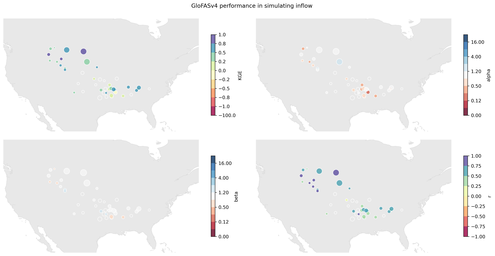

***Figure 6**. GloFASv4 performance in simulating reservoir inflow. It shows the modified Klin-Gupta efficiency coefficient (KGE) and its three components: correlation (r), ratio of the coefficient of variance (alpha) and bias (beta). The size of the dots represents total reservoir capacity.*

The performance of the simulated reservoir inflow is overall good. 20% of the reservoirs show a KGE larger than 0.5, whereas only 2% have a KGE below -.41 (the performance of the mean inflow value). The 2 worst performing reservoirs are again in the Southeast US.

The correlation between the simulated and observed inflow is overall good. However the bias ($beta$) and the ratio of the coefficient of variation ($alpha$) show some outliers. In terms of bias, there's a subset of reservoirs (mostly in the West) with very low bias, i.e, the simulation underestimates inflow. The two worst performing reservoirs (in the Gulf of Mexico) show opposite bias, one with a large positive bias and one with a large negative bias. In terms of the coefficient of variation, the reservoirs in the Southeast show a lack of variation in the simulation, i.e., low $alpha$ values.

#### 4.2.1 Time series decomposition

Similarly to what was done for the storage time series, I have decomposed the inflow time series to find out why the performance is good in some reservoirs. They are not shown here because they are not as informative as those of reservoir storage.

>**Note**. It is surprising that ResOpsUS reports for several reservoirs inflow values well above (even hundreds of times) the non-damaging outflow ($ndq$) used in LISFLOOD.

>Revise outliers in the ResOpsUS data set.

### 4.3 Reservoir outflow

The maps below show the GloFAS performance in the last of the three reservoir variables, the outflow. ResOpsUS contains outflow time series for 96 out of the 107 reservoirs analysed here.

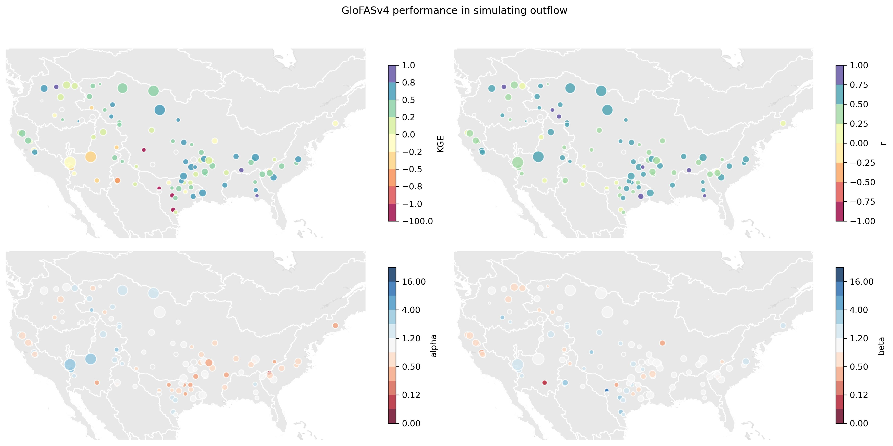

***Figure 7**. GloFASv4 performance in simulating reservoir outflow. It shows the modified Klin-Gupta efficiency coefficient (KGE) and its three components: correlation (r), ratio of the coefficient of variance (alpha) and bias (beta). The size of the dots represents total reservoir capacity.*

The performance of the reservoir outflow simulation is overall good, especially in the Southeast, which contradicts the performance seen before in terms of storage. In the outflow simulation, the most problematic area is the central South (Gulf of Mexico) and Southwest (Colorado River).

The correlation between simulated and observed outflow is very good overall, again with better values in the Shoutheast and Northwest. As seen in the inflow, there is a lack of variation ($alpha < 1$) in the Southeast, in spite of having a good KGE. On the other hand, some reservoirs in the Colorado and northern part of the Mississippi overestimate the ratio of the coefficient of variation. In terms of bias, there are several reservoirs with excesive outflow in the Gulf of Mexico, and underestimation of outflow in the West (Pacific and Columbia).

#### 4.3.1 Time series decomposition

Figue 8 shows some examples of the decomposition of the outflow time series.

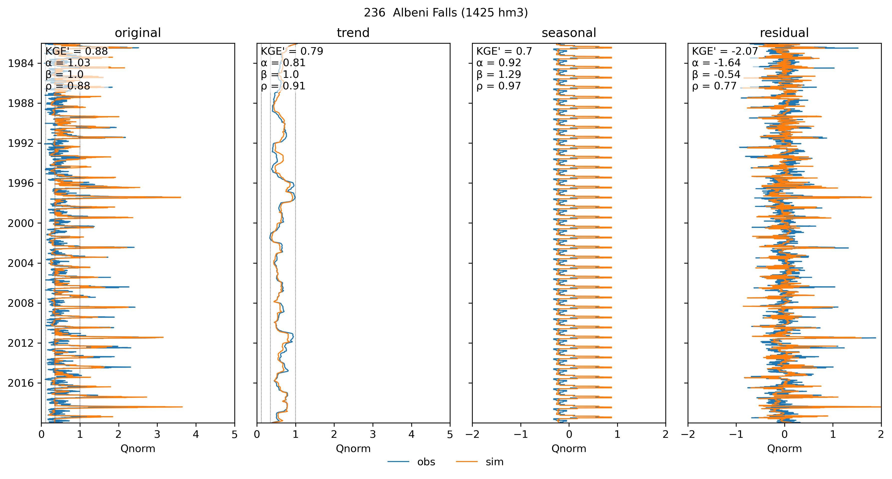
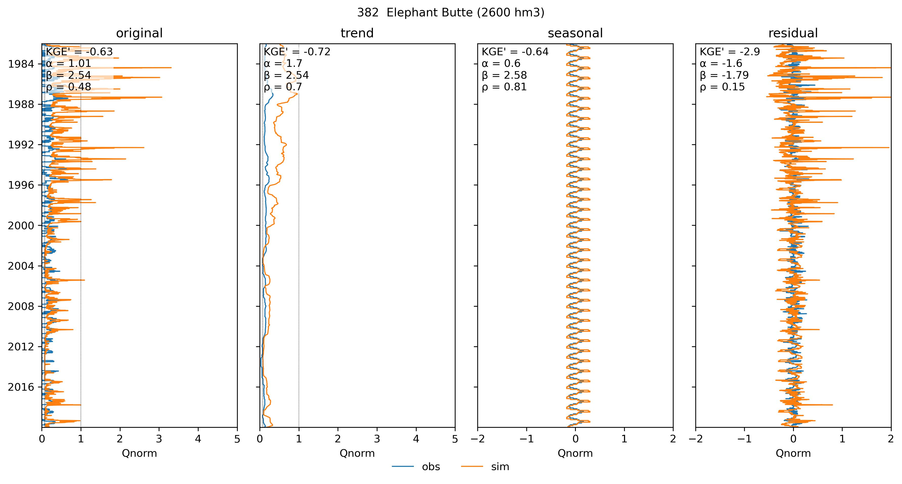
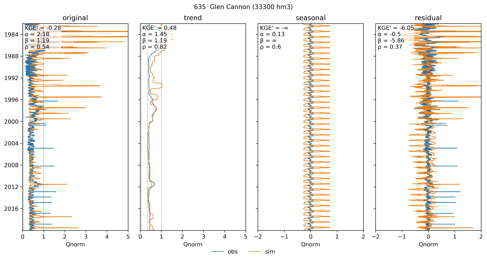
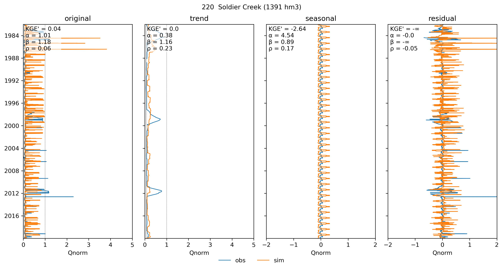

***Figure 8**. Time series of reservoir outflow and their decomposition in trend, seasonality and residuals. The dotted, vertical lines show the reservoir outflow limits (conservative, normal adjusted and non-damaging) used in the LISFLOOD reservoir routine. Outflow values are normalized by the non-damaging outflow, so any value above one represents and outflow over this limit.*

The reservoir 236 is the reservoir with the highest performance. Both the trend and the seasonality are appropiately reproduced by GloFAS.

The reservoir 382 is an example of a biased outflow simulation. The model overpredicts outflow, which can be seen both in the original and trend time series.

The reservoir 635 is an example of a simulation that underpredicts the coefficient of variation of outflow. The bias and correlation coefficient of the original time series are good, but the simulation overpredicts the seasonal variation.

The reservoir 220 is an example of a simulation with no bias and correct coefficient of variation, but with a poor correlation coefficient due to a shift in the seasonality and an excesive daily variation.

>**Note**. It is surprising that for some reservoirs, both the observed and simulated time series, the outflow clearly exceeds (dozens or hundreds of times) the non-damaging outflow ($ndq$) used in LISFLOOD. Reservoirs 193 and 71 are extreme cases caused by very low outflow limits in LISFLOOD.

### 4.4 Comparison of the 3 variables

The figure below summarises the performance of the three previous variables. It shows the KGE of each pair of variables to look for possible correlations, and it shows the ECDF of each variable.

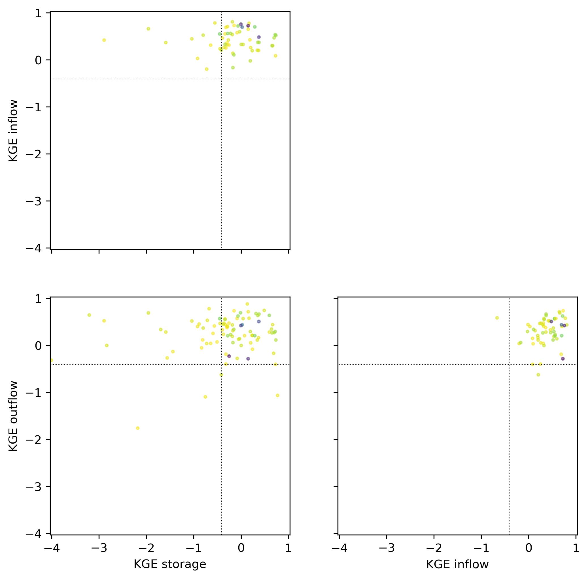

***Figure 9**. Summary of the reservoir performance in GloFAS. The top, right panel shows the empirical cumulative density function of the KGE for storage, inflow and outflow. The other three plots compare the KGE of every pair of variables. The colours represent reservoir size (lighter yellow for small reservoirs and dark purple for large ones).*

Both inflow and outflow clearly outperform reservoir storage. Since the only variable used in the calibration of LISFLOOD is streamflow, it makes sense that the flow variables perform distinctively better than storage. This fact indicates that, even though the water stored in the reservoirs can be off the real values, the performance in streamflow simulation can still be correct.

If we focus on the largest reservoirs (blueish dots), they all perform relatively good in terms of storage and inflow, but some of them failed at reproducing outflow.

>**Question**. Do we want to represent correctly reservoir storage? That would be the case if we want to assimilate data about the reservoir state (either using in situ observations or remotely sensed). In that case, it would be important to fit the reservoir model parameters to reproduce both outflow and storage.

## 5 Reservoir routine

In the previous section I analysed the performance of the model in reproducing three reservoir variables. In the last subsection I have started to look at the relations between the three variables. Now I want to see how realistic is the LISFLOOD reservoir routine when exposed to observed records.

To do so, I have create pair-wise scatter plots of storage-outflow and inflow-outflow daily time series. In these plots I show both the observed (blue) and simulated (orange) timeseries. I include also the LISFLOOD reservoir routine (black, solid line) controled by 8 parameters (5 storage limits and 3 outflow limits). Moreover, density plots show the overlap in the distribution of the observed and simulated timeseries. Figure 10 shows a few examples of these type of plots.

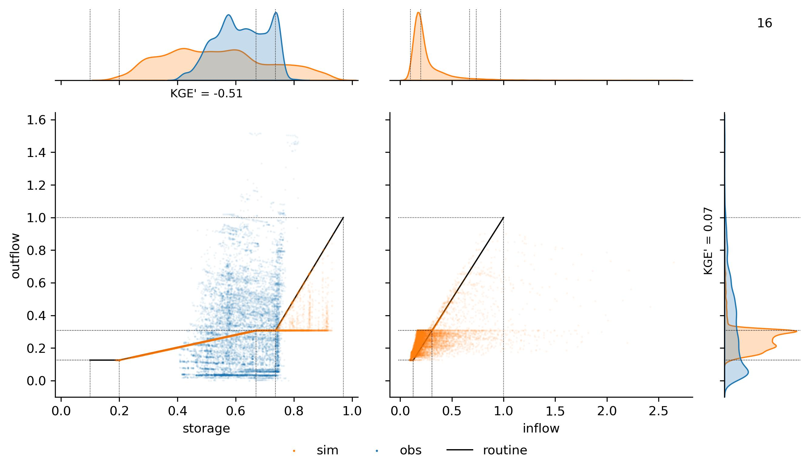
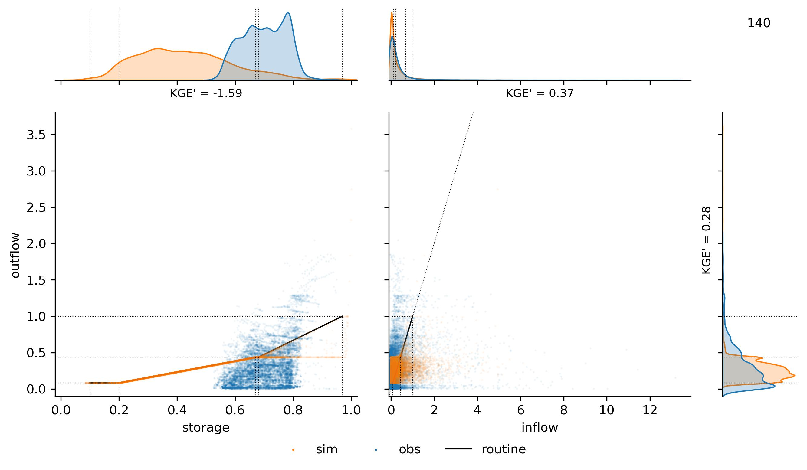
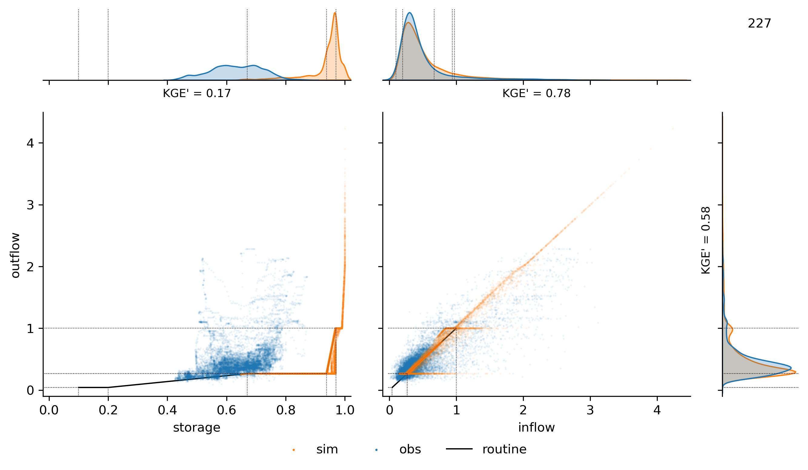
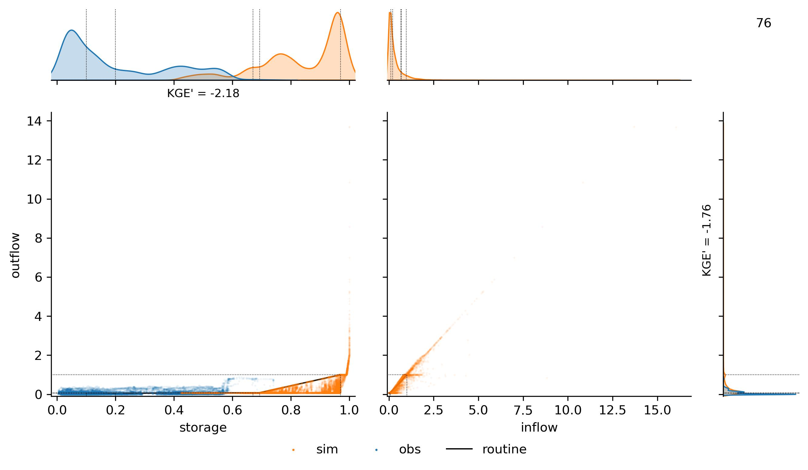

***Figure 10**. Representation of the reservoir behaviour in the simulated (orange) and observed (blue) time series. The left panel shows the pair plot between storage and ouflow; the black, solid line represents the reference LISFLOOD routine defined by 5 pairs of storage-outflow values. The right plot compares inflow and outflow; the black-solid line is the 1:1 line. Density plots show the overlap of the observed and simulated distributions for each of the three variables.*

The reservoir 76 is included here because it is a clear example of the LISFLOOD reservoir routine. The outflow is a linear function of the storage unless it largely exceeds the inflow. This plot shows that the dispersion in the reservoir-outflow cannot be modelled with such a fixed reservoir routine, where a given storage produces a fixed outflow unless it exceeds certain limitations. However, as seen before, this simple routine is able to reproduce correctly the outflow in many cases. Another idea to extract from this first example is the offset between the storage limits and the actual reservoir behaviour. In this case, the actual reservoir storage varies between 0.4 and 0.75, whereas the LISFLOOD parameters allow for a variation betweeen 0.2 and 1. This has been seen in many reservoirs, this is not an unusual case.

The second plot is an example of a reservoir (ResID=140) in which the inflow and outflow time series are simulated decently well, but the storage is completely off. As in the first case, the observed storage fluctuate in a narrow range between 0.55 and 0.8, whereas the simulation expands a very wide range from 0.1 to close to 1. The density plots are a good summary of how the inflow and outflow time series overlap the observations, but the storage is wrongly simulated.

Reservoir 227 is a case in which the inflow performs particularly well, and the outflow performs good, in spite of simulating a storage out of the observed range. The outflow density plot shows a typical case in which there are two modes that correspond to the adjusted normal outflow and the non-damaging outflow.

Lastly, reservoir 76 represents one of the poorer performances in terms of outflow. I have included it here for two reasons. One is the difference between the observed and simulated storages. The other is the extraordinarily high values of both inflow and outflow, which exceed the non-damaging value up to 15 times

## 6 Ideas

The idea of the plots in the previous section was to compare the simplified reservoir routine in the model with the actual reservoir behaviour. Of course a model must be a simplification of the reality, so it cannot capture all the variability in the observed data, but some improvements could be implemented.

* It is to be analysed, but probably some of the dispersion in the storage-ouflow plots can be explained by covariables such as seasonality, inflow, expected precipitation, main reservoir use. The approach by [Turner et al. (2021)](https://www.sciencedirect.com/science/article/pii/S0022169421008933) would be an example.
* The storage and outflow limits in the LISFLOOD routine could be fitted to the observations. We've seen that storage limits do not represent in most of the cases the actual reservoir operation. A regionalization approach should infer the storage/outflow limits in reservoirs without data. This would not affect the LISFLOOD calibration, which would still fit the normal storage and outflow, but the idea is to start the calibration from a more realistic routine.
* If the previous point is tested, remove the fix value of 2 ($2 \cdot c_{lim}$) as the upper limit for the minimum outflow, and fit that multiplier of the conservative limit.

**Others:**
* I have not used yet the evaporation time series included in ResOpsUS.
